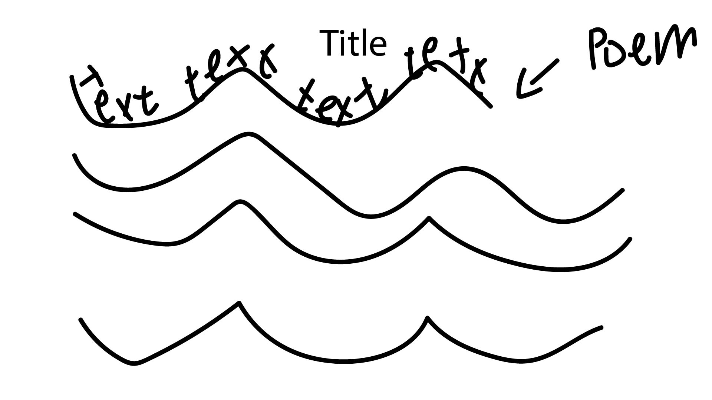
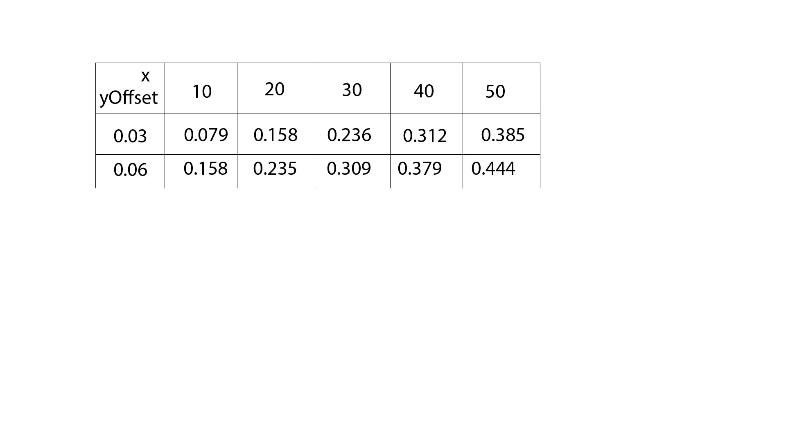

# Song of the Sea
The poem I choose is: Song of the sea, by Rainer Maria Rilke

Timeless sea breezes,
sea-wind of the night:
you come for no one;
if someone should wake,
he must be prepared
how to survive you.
‍

Timeless sea breezes,
that for aeons have
blown ancient rocks,
you are purest space
coming from afar…
‍

Oh, how a fruit-bearing
fig tree feels your coming
high up in the moonlight.
‍
It is published in: Der neuen Gedichte anderer Teil, in 1907

My code is related to the poem that, to my understanding, this poem highlights the greatness and timelessness of the sea compare to mankind, So I create a wave effect using text to recreate the effect of the ocean and make it loop untill the bottom of the screen to show the endless feeling of the sea and how it keep existing through out the time.

I want to work on this because I planned to use the "sine wave" for the clock assignment but didn't make it work, so for this time, I was trying to figure out how to use sine wave for text. For my code, the texts wave by each letters (powered by sine wave) and when they reach the bottom of the wave they will be larger and smaller while at the top(so that it can create sort of a 3D effect). The poem will repeat and loop until the bottom of the page, meanwhile, it will move right some distance as it repeats, so that it can create a sense of the coast line.
The sine wave is really hard, I research many resources and went through a harsh debugging session with my computer science friend to finally get it work. Here I will try to explain: Because as sin(x), x increases, the y value would increase to 1 and decrease to -1 back and forth like a wave (see the picture attached) so this is the trait that we can use the to create a curve.
So for the core line of code for sine wave: "let waveValue = sin(yOffset + x*0.01);" It create sine wave value to create vertical displacement (up-and-down motion) of the text as we move throught the letters. So generally we can view each letter as an object on its own, two factors should be deciding its y position: first is the time (because this is a moving animation), the second is its horizontal position (in the line). In my code, as yOffset's amount increase through time, it makes sure the objects is moving up and down as time pass; the second part is x*0.01, this relates the letter's yposition to its X position on the canvas, (see image below).

Image on repo:  

